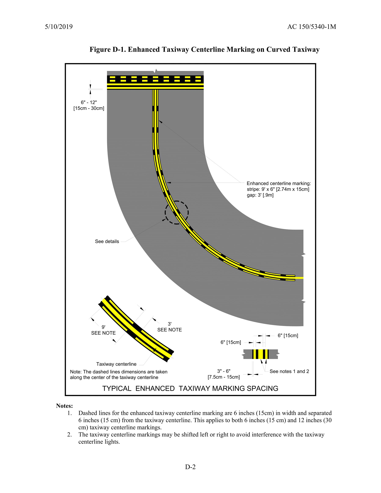
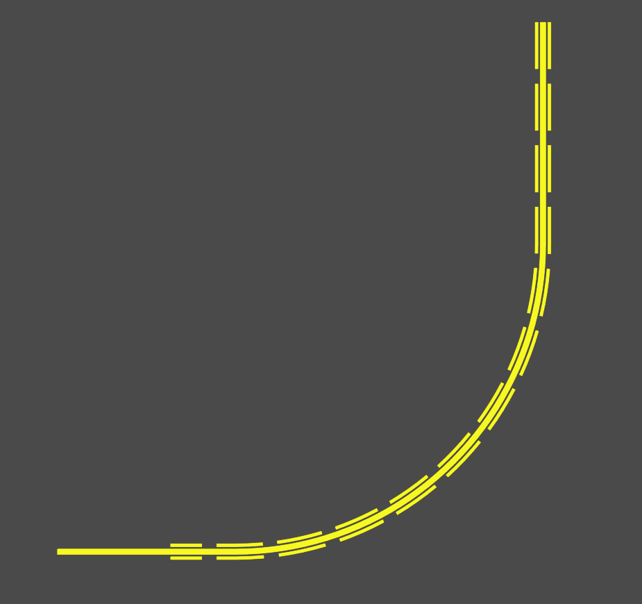

# EnhancedTaxiwayCenterline

AutoCAD .NET plugin for drafting FAA-style enhanced taxiway centerline markings from an existing polyline near a runway holding position.

## Overview

This command takes a selected taxiway centerline polyline and builds two sets of offset dashed polylines along the first 150 drawing units. It is intended for quickly generating enhanced taxiway centerline markings in AutoCAD without manually drawing each dash segment, which is especially helpful for curved taxiways where the dash pattern needs to follow the curve. The generated geometry is based on the FAA enhanced taxiway centerline marking standard described in `AC 150/5340-1M`.

The plugin is built as a managed AutoCAD DLL and can be loaded with `NETLOAD`.

## Download Or Build

- Preferred: download the latest compiled DLL from GitHub Releases.
- Alternative: build the project locally by following [BUILDING.md](BUILDING.md).

## FAA Basis

This tool is intended to help draft enhanced taxiway centerline geometry based on the current FAA airport marking standard for enhanced taxiway centerlines in `AC 150/5340-1M`. Its hard-coded pattern uses the standard `150`-foot enhancement length and a `9`-foot dash / `3`-foot gap pattern.

## FAA Reference Figure

FAA `AC 150/5340-1M`, Figure `D-1`, showing typical enhanced taxiway centerline marking spacing on a curved taxiway:

## Example Output

Example output generated by this script in AutoCAD:

## Command

- Command name: `ENHANCEDCL`

## What The Command Does

When you run `ENHANCEDCL`, the plugin:

- prompts you to select a polyline
- starts the dash pattern from the source polyline's first vertex
- applies the enhancement over the first `150` drawing units of the source polyline, or the full polyline if it is shorter
- creates dash segments with these current hard-coded settings:
  - dash length: `9`
  - gap length: `3`
  - offset from centerline: `1.25` on each side (with a source polyline width of `1.00` this places the `0.5` width dashes using the required `0.5` gap between the outer edge of the centerline and the inner edge of the dashes).
  - dash width: `0.5`
- copies the source polyline's display properties to the generated dashes:
  - layer
  - color
  - linetype
  - linetype scale
  - lineweight
  - transparency
- deletes any prior dash polylines previously generated by this script for the same source polyline before creating the new set

## Requirements

- AutoCAD 2026 installed locally so Visual Studio can reference the AutoCAD .NET API assemblies
- Visual Studio 2022 for building

## Load In AutoCAD

1. Open AutoCAD.
2. Make sure the folder containing `EnhancedTaxiwayCenterline.dll` is included in your AutoCAD profile's `Trusted Locations` list.
3. In AutoCAD, open `Options`, go to the `Files` tab, expand `Trusted Locations`, and add the folder that contains the DLL if it is not already trusted.
4. Run `NETLOAD`.
5. Browse to the compiled DLL you downloaded from GitHub Releases, or to the locally built Release DLL if you built the project yourself.
6. Select `EnhancedTaxiwayCenterline.dll`.
7. Run `ENHANCEDCL`.
8. Select the taxiway centerline polyline when prompted.

## Selection Rules

The command expects:

- an open `Polyline`
- an unlocked source layer

It will reject closed polylines and non-polyline entities.

## Notes

- The dash pattern always begins at the source polyline start vertex, so polyline direction matters.
- If the selected polyline is shorter than `150` drawing units, the enhancement is limited to the available length.
- The current hard-coded geometry is aimed at the FAA enhanced centerline pattern when the drawing is authored in feet.
- The script stores the relationship between a source polyline and the dashes it creates in the drawing database. If you save the drawing, close AutoCAD, reopen the same drawing later, and rerun `ENHANCEDCL` on that same source polyline, the script will attempt to remove the prior script-generated dashes linked to that polyline before creating a new set.
- If the source polyline is deleted and recreated, substantially replaced, or the stored linkage is otherwise lost, the script will treat it as a new source and will not automatically remove older unlinked dash geometry.
- This script is provided as-is, without warranty or guarantee of fitness for any project, computer, or workflow. You are responsible for reviewing the output, confirming project compliance, maintaining backups, and using it at your own risk.

## Building

Detailed build steps are documented in [BUILDING.md](BUILDING.md).

Keywords: `AutoCAD`, `AutoCAD .NET`, `FAA`, `FAA AC 150/5340-1M`, `enhanced taxiway centerline`, `airport markings`, `runway holding position`, `NETLOAD`, `lisp`, `LSP`, `airport design`.
